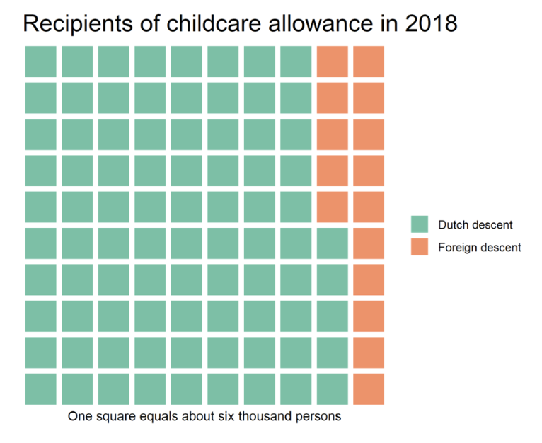
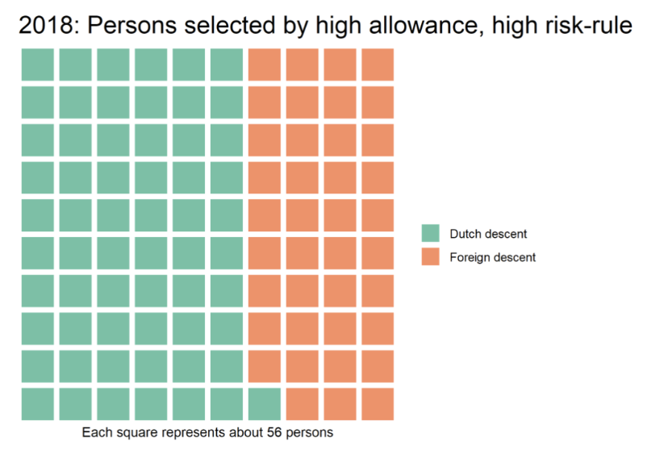

---

## What happened?

-   Childcare allowance helps parents pay for licensed childcare\
    -   Dutch Tax Authority introduced an automated **risk-scoring** system\

    -   System disproportionately flagged minorities

    -   “High-risk” cases treated as fraud with **little/no human review\
        **

    -   Innocent families fined, lost benefits, pushed into debt\

    -   Scandal contributed to fall of Dutch government (2021)

---

## Was the data used legally?

-   Applicants provided data (income, job, nationality, childcare provider)
-   Collection was legal **only for calculating eligibility/benefits**
-   Tax Authority repurposed data for **fraud detection**
-   Sensitive traits (e.g., nationality, dual citizenship) used in scoring
-   Dutch Data Protection Authority (2020): **illegal processing** + bias

---

:::: {.columns}

::: {.column width="50%"}
{fig-align="center" width="433"}

**Image source:** Netherlands Institute for Human Rights, via Equinet Europe.
:::

::: {.column width="50%"}
{fig-align="center" width="500"}

**Image source:** Netherlands Institute for Human Rights (Equinet Europe).
:::

::::

---

## Should race or nationality be used?

-   No evidence linking immigration background to fraud\
-   Using these traits reinforces **historical discrimination**\
-   Vulnerable families forced into:
    -   Debt
    -   Eviction
    -   Mental stress
    -   Family instability\
-   Nationality became a **proxy for “fraud risk”** → systemic bias

---

## Why does this matter?

-   Shows dangers of **unchecked algorithmic decision-making**
-   Harm was widespread but **not equally distributed**
-   Most damage fell on marginalized families already at risk\
-   No clear beneficiaries, but significant loss of trust and stability\
-   Highlights need for:
    -   Transparency
    -   Oversight
    -   Accountability in public-sector algorithms

---

## References

Alexander Hoogenboom. (2022, November 2). Dutch Childcare Allowance Scandal: The importance of investigation powers. Equinet. (https://equineteurope.org/netherlands-institute-for-human-rights-role-in-the-investigation-of-the-childcare-allowance-scandal/)

Amnesty International. (2021, October 25). Dutch childcare benefit scandal an urgent wake-up call to ban racist algorithms. (https://www.amnesty.org/en/latest/news/2021/10/xenophobic-machines-dutch-child-benefit-scandal/)
